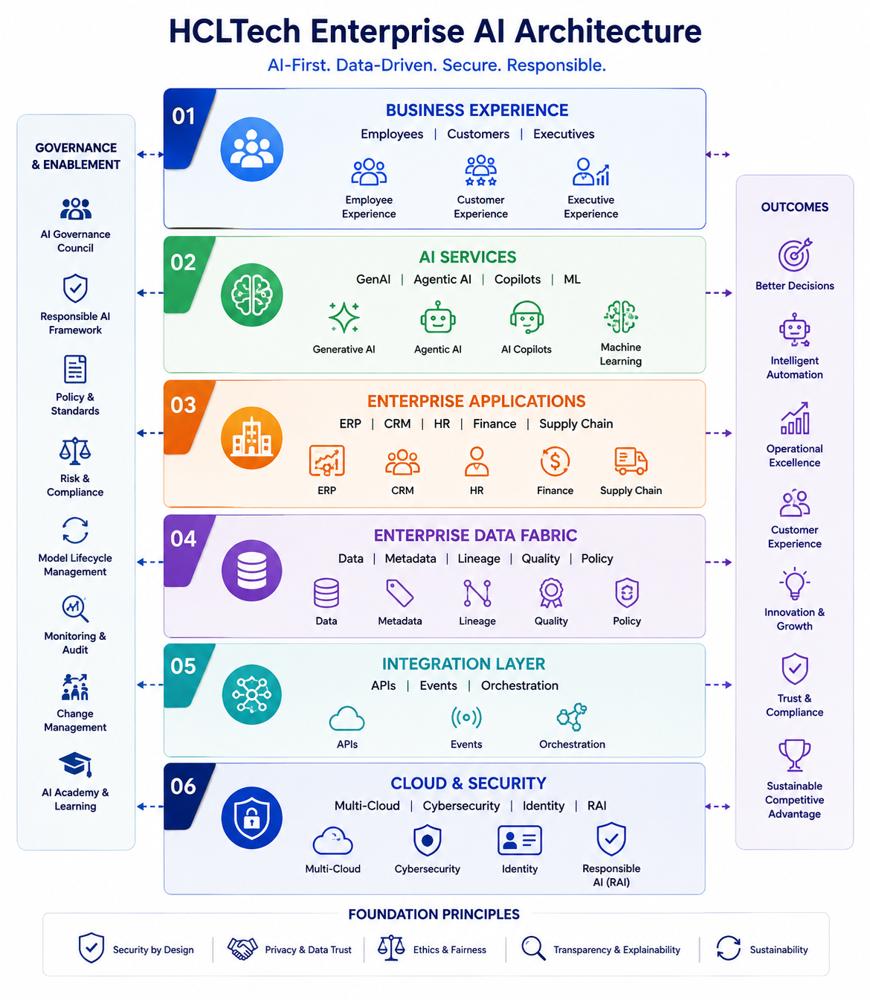

# hcltech-enterprise-ai-transformation
This capstone proposes a 24-month enterprise AI transformation strategy for HCLTech, moving the organization from fragmented AI initiatives to an integrated, governed and scalable AI-first operating model.


The case study is structured around **8 transformation chapters**, moving from organizational assessment → people → processes → technology → resilience → change → culture → execution/governance. 

---

# HCLTech Enterprise AI & Digital Transformation Strategy

## Executive Overview

This case study presents a **24-month Enterprise AI & Digital Transformation Strategy for HCLTech**, with the objective of transforming the organization from a digitally enabled enterprise into an **AI-first enterprise**.

The transformation is not positioned as a technology implementation alone. It integrates:

* Organization
* People
* Business Processes
* Technology
* Enterprise Resilience
* Change Management
* Digital Culture
* Governance
* Business Outcomes

The strategic vision is to establish HCLTech as a globally recognized **AI-first enterprise**, powered by trusted data, intelligent automation, Responsible AI and continuous innovation. 

---

# 1. Why Enterprise AI Transformation?

HCLTech has strong capabilities in cloud, engineering, cybersecurity, digital services and enterprise modernization, with operations across **60+ countries, 2,100+ enterprise clients and 223K+ professionals**. 

However, enterprise-scale AI adoption is constrained by:

* Fragmented enterprise data
* Siloed AI initiatives
* Legacy technology
* Uneven AI workforce capabilities
* Inconsistent AI governance
* Distributed enterprise knowledge

The transformation therefore focuses on creating a **connected, governed and scalable AI ecosystem** rather than deploying isolated AI solutions. 

### Strategic Ambition

The transformation aims to:

1. Democratize trusted enterprise data
2. Embed AI across business functions
3. Build an AI-ready workforce
4. Establish Responsible AI governance
5. Create a scalable operating model for continuous innovation 

---

# 2. Three Flagship Enterprise AI Initiatives

The transformation is anchored around three strategic AI pilots.

### 1. AI Data Governance Copilot

A Generative AI-powered assistant that enables employees to:

* Discover enterprise data
* Understand metadata
* Trace data lineage
* Understand governance policies
* Improve data quality
* Interact with enterprise data through natural language

It establishes the **trusted-data foundation** required for enterprise AI. 

### 2. Predictive Supply Chain Control Tower

An AI-driven platform that monitors:

* Supplier performance
* Inventory
* Logistics
* Manufacturing demand
* Operational risks

The objective is to shift supply-chain management from **reactive monitoring to predictive decision-making**. 

### 3. Executive AI Decision Intelligence Platform

An executive decision-support platform combining:

* Enterprise KPIs
* Predictive analytics
* AI-generated insights
* Recommended actions
* Scenario planning

The objective is to enable **faster, data-driven executive decisions**. 

### Why These Three Pilots?

Together they demonstrate AI value across three critical enterprise dimensions:

**Data → Operations → Executive Decisions**

They also provide reusable patterns for future AI deployments across HCLTech. 

---

# Chapter 1 — Organizational Analysis

## Objective

Assess HCLTech's current AI readiness and determine what organizational changes are required to become an AI-first enterprise.

### Current-State Assessment

The Digital Maturity Assessment evaluated eight dimensions:

| Capability             | Current    | Target    |
| ---------------------- | ---------- | --------- |
| Executive Leadership   | High       | Optimized |
| Cloud & Infrastructure | High       | Optimized |
| Cybersecurity          | High       | Optimized |
| Enterprise Data        | Moderate   | Optimized |
| AI Adoption            | Moderate   | Optimized |
| Process Automation     | Moderate   | Optimized |
| Workforce AI Readiness | Developing | Optimized |
| Innovation Culture     | Moderate   | Optimized |

The key insight is that HCLTech already has strong **leadership, cloud and cybersecurity foundations**, but enterprise data, AI adoption, process automation, workforce readiness and innovation culture require greater consistency. 

### Five Strategic Challenges

1. Fragmented Enterprise Data
2. Decentralized AI Initiatives
3. Legacy Technology
4. Workforce Capability Gaps
5. Governance & Responsible AI

### Strategic Assessment Frameworks

The chapter uses:

* **Digital Maturity Assessment**
* **SWOT Analysis**
* **McKinsey 7S**

The McKinsey 7S assessment moves HCLTech toward:

**Digital-first → AI-first**

**Business-unit driven → Federated AI operating model**

**Partially integrated systems → Unified AI ecosystem**

**Specialized AI skills → Enterprise-wide AI capability**

**Collaborative leadership → Data-driven, AI-enabled leadership**

### Chapter Outcome

The organizational assessment establishes the business case and provides the foundation for the remaining transformation chapters.

---

# Chapter 2 — People Transformation

## Objective

Build an **AI-ready workforce** capable of working effectively with AI rather than treating AI as a replacement for people.

The case study explicitly positions sustainable AI adoption around the combination of **human expertise + AI capabilities**. 

### Key Workforce Challenges

* Uneven AI literacy
* Resistance to AI-driven change
* Leadership capability gaps
* Global workforce diversity
* Continuous skills evolution

### Enterprise AI Academy

A role-based learning ecosystem is proposed for:

| Employee Group        | Focus                                   |
| --------------------- | --------------------------------------- |
| Executives            | AI strategy, governance, business value |
| Senior Managers       | AI adoption and change leadership       |
| Engineers             | GenAI, MLOps, LLMs                      |
| Business Users        | AI productivity and prompt engineering  |
| Data/Governance Teams | Metadata, Responsible AI, data quality  |

Learning includes courses, workshops, AI labs, certifications, hackathons and Communities of Practice. 

### Change Framework

Two complementary frameworks are used:

**ADKAR → Individual Change**

* Awareness
* Desire
* Knowledge
* Ability
* Reinforcement

**Kotter → Organizational Change**

Used to create urgency, build leadership coalition, communicate the vision, generate quick wins, scale successful pilots and anchor AI into governance and performance management. 

### Key People KPIs

| KPI                     |  Current | 24-Month Target |
| ----------------------- | -------: | --------------: |
| AI Literacy             |      40% |             95% |
| AI Certification        |      28% |             90% |
| Employee Engagement     |      74% |             92% |
| AI Tool Adoption        |      30% |             85% |
| AI Champions            |      600 |           3,000 |
| AI Innovation Ideas     | 180/year |      1,500/year |
| Leadership AI Readiness |      55% |             95% |


---

# Chapter 3 — Process Transformation

## Objective

Move from **digitized processes to intelligent enterprise operations**.

The central principle is:

> Don't simply automate existing processes. Redesign how work is performed, decisions are made and value is created.

### Current Process Challenges

* Process variability
* Manual decision-making
* Limited process visibility
* Data fragmentation
* Limited AI integration

### Future-State Operating Model

AI will:

* Assist business decisions
* Orchestrate intelligent workflows
* Connect enterprise data
* Automate compliance monitoring
* Provide predictive insights
* Continuously optimize performance

### Three-Tier Automation Model

**1. Process Automation**

Automate repetitive work.

**2. Decision Automation**

Use AI-generated recommendations.

**3. Autonomous Operations**

AI agents execute routine actions with human oversight.

This creates a gradual path from automation → AI-assisted decisions → autonomous operations while maintaining human accountability.

### AI Pilots as Process Transformation Engines

The three pilots demonstrate process value through:

* Faster data discovery and governance
* Predictive supply-chain management
* Faster executive decision-making

For example, the Data Governance Copilot is expected to reduce manual support effort significantly while improving data discovery, compliance and data quality.

### Process KPIs

| KPI                     | Current |   Target |
| ----------------------- | ------: | -------: |
| Process Automation      |     35% |      90% |
| Manual Reporting Effort |    100% |      40% |
| Decision Cycle Time     |  5 days | Same day |
| Process Compliance      |     84% |      98% |
| Forecast Accuracy       |     72% |      95% |
| Customer Response Time  |  24 hrs |    4 hrs |
| Process Standardization |     55% |      95% |

---

# Chapter 4 — Technology Transformation

## Objective

Create a **unified Enterprise AI technology ecosystem** instead of independent AI solutions.

The technology strategy moves from:

**Fragmented platforms → Integrated Enterprise AI Platform**

### Seven Technology Objectives

* Unified Enterprise AI Platform
* Trusted Enterprise Data Fabric
* Democratized AI
* Responsible AI governance
* Agentic AI-enabled automation
* API-first integration
* Secure, scalable cloud-native AI ecosystem

### Target Architecture

The future-state architecture consists of six interconnected layers:

```text
Business Experience Layer
        ↓
AI Services Layer
        ↓
Enterprise Applications
        ↓
Enterprise Data Fabric
        ↓
Integration Layer
        ↓
Cloud & Security Layer
```

The architecture connects business experiences, AI services, enterprise applications, governed data, APIs/event streaming and cloud/security capabilities. 

### Six Strategic Technology Pillars

1. **Enterprise Data Fabric**
2. **AI Data Governance Copilot**
3. **Enterprise Knowledge Graph**
4. **Agentic AI Platform**
5. **Executive AI Decision Intelligence Platform**
6. **Responsible AI Framework**

The Data Fabric provides the trusted data foundation, while the Knowledge Graph provides enterprise context and Agentic AI enables intelligent workflow execution. 

### Technology Governance

An **Enterprise AI Governance Council** oversees:

* AI standards
* Model lifecycle
* Responsible AI
* Cybersecurity
* Data governance
* Investment prioritization
* AI risk
* Vendor governance 

### Technology KPIs

Key 24-month targets include:

* Enterprise AI Platform Adoption → **90%**
* Trusted Data Score → **98%**
* AI Model Reusability → **85%**
* API Integration Coverage → **95%**
* AI Governance Compliance → **100%**
* Cloud AI Workload Coverage → **90%**
* AI Solution Reuse → **80%** 

---

# Chapter 5 — Enterprise Disruption Management

## Objective

Build an organization that can **anticipate, absorb and respond to disruption** rather than simply react after disruption occurs.

### Major Risk Categories

| Risk                       | Priority |
| -------------------------- | -------- |
| Cybersecurity              | Critical |
| Geopolitical Events        | High     |
| AI Regulatory Changes      | High     |
| Market/Economic Volatility | High     |
| Technology Disruption      | High     |


### Strategic Response

The strategy introduces:

* AI-driven disruption monitoring
* AI-assisted Security Operations
* Zero Trust Architecture
* Multi-region cloud
* Regional Business Continuity Plans
* AI-based geopolitical monitoring
* Regulatory compliance monitoring
* Model audit trails
* Predictive disruption detection
* Intelligent workload redistribution
* Executive crisis dashboards

### Responsible AI as Risk Management

Responsible AI is embedded around six principles:

**Fairness → Transparency → Accountability → Privacy → Security → Compliance**

These principles apply throughout the AI lifecycle. 

### Resilience KPIs

| KPI                           | Current | Target |
| ----------------------------- | ------: | -----: |
| Cybersecurity Response Time   |   6 hrs |  <1 hr |
| Business Continuity Readiness |     82% |    98% |
| AI Regulatory Compliance      |     75% |   100% |
| Enterprise Risk Detection     |     60% |    95% |
| Critical Service Availability |   99.2% | 99.99% |
| AI Governance Audit Score     |     72% |    98% |
| Operational Recovery Time     |  12 hrs | <2 hrs |
| Enterprise Resilience Index   |     68% |    95% |


---

# Chapter 6 — Change Management

## Objective

Ensure that Enterprise AI adoption changes **employee behavior, operating practices and decision-making**, not just technology.

A dedicated **Change Management Office (CMO)** is established under the joint leadership of the CDO and CAIO. 

### Six Change Priorities

1. Create a shared Enterprise AI vision
2. Strengthen executive sponsorship
3. Build employee confidence
4. Minimize resistance
5. Enable consistent business-unit adoption
6. Sustain long-term behavioral change

### Major Change Barriers

* Different workforce expectations
* AI adoption resistance
* Leadership inconsistency
* Transformation fatigue
* Difficulty sustaining long-term adoption

### Change Strategy

The case study combines:

**ADKAR + Kotter**

with:

* CEO communication
* AI Champions
* AI Academy
* Leadership roadshows
* AI Communities of Practice
* Quick wins from AI pilots
* Recognition programs
* Continuous feedback

### Change KPIs

| KPI                         | Current | Target |
| --------------------------- | ------: | -----: |
| Employee AI Awareness       |     45% |    98% |
| AI Adoption                 |     30% |    90% |
| Leadership Engagement       |     60% |   100% |
| Training Completion         |     35% |    95% |
| Employee Engagement         |     74% |    92% |
| Change Champions            |     250 |  2,500 |
| Transformation Satisfaction |     70% |    95% |
| Business Unit Adoption      |     40% |   100% |


---

# Chapter 7 — Building a Digital-First Culture

## Objective

Make AI adoption **part of the organizational culture**, rather than a temporary transformation program.

The desired culture encourages:

* Experimentation
* Data-driven decisions
* Continuous learning
* Responsible AI
* Knowledge sharing
* Cross-functional collaboration
* Customer obsession


### Cultural Transformation Challenges

1. Functional silos
2. Fear of experimentation
3. Inconsistent AI mindset
4. Limited knowledge reuse
5. Difficulty sustaining innovation

### Cultural Response

The strategy introduces:

* Enterprise Communities of Practice
* Cross-functional innovation programs
* AI collaboration platforms
* Innovation sandboxes
* AI Champions Network
* Enterprise AI playbooks
* Enterprise Knowledge Graph
* Internal AI solution marketplace
* AI Innovation Awards
* Hackathons
* Innovation funding


### Enterprise Innovation Ecosystem

```text
AI Innovation Labs
       +
Enterprise Hackathons
       +
Customer Co-Innovation
       +
AI Communities of Practice
       +
Innovation Funding
       +
AI Solution Marketplace
       +
Internal Startup Accelerator
       ↓
Scalable Enterprise Innovation
```

### Culture KPIs

| KPI                            | Current | Target |
| ------------------------------ | ------: | -----: |
| Employee AI Adoption           |     30% |    90% |
| Innovation Participation       |     35% |    85% |
| Cross-functional Collaboration |     60% |    95% |
| Knowledge Reuse                |     45% |    90% |
| AI Learning Participation      |     40% |    95% |
| Innovation Satisfaction        |     72% |    92% |
| AI Solution Reuse              |     20% |    80% |
| Digital Culture Index          |     58% |    95% |


---

# Chapter 8 — Enterprise AI Transformation Roadmap

## Objective

Convert the strategy into a **disciplined 24-month execution roadmap**.

The transformation is deliberately phased rather than implemented as one large program. 

## 24-Month Roadmap

```text
Months 1–6
FOUNDATION
      ↓
Months 7–12
PILOT & VALIDATE
      ↓
Months 13–18
SCALE ACROSS ENTERPRISE
      ↓
Months 19–24
ENTERPRISE OPTIMIZATION
```

### Phase 1 — Foundation | Months 1–6

Focus:

* Enterprise AI Governance Council
* Enterprise AI Academy
* Enterprise Data Fabric
* Responsible AI policies
* API-first integration
* Technology assessment
* Priority AI use cases

**Outcome:** Governance + trusted data + AI-ready workforce. 

### Phase 2 — Pilot & Validate | Months 7–12

Deploy:

* AI Data Governance Copilot
* Predictive Supply Chain Control Tower
* Executive AI Decision Intelligence Platform

Also measure:

* AI adoption
* Business impact
* Operational efficiency
* Governance effectiveness

**Outcome:** Demonstrated business value and executive confidence. 

### Phase 3 — Scale | Months 13–18

* Expand AI across business units
* Implement Enterprise Knowledge Graph
* Introduce Agentic AI
* Standardize enterprise processes
* Expand AI Champions
* Scale AI learning globally

**Outcome:** Enterprise-wide AI adoption, standardized governance and increased automation. 

### Phase 4 — Optimize | Months 19–24

* Continuous model optimization
* Advanced predictive analytics
* AI-driven business planning
* Enterprise innovation accelerator
* Quarterly AI maturity assessments
* Continuous improvement

**Outcome:** AI embedded into operations, mature governance, innovation culture and sustainable competitive advantage. 

---

# Enterprise Governance Model

The transformation uses a clear executive accountability structure:

| Role                     | Responsibility                      |
| ------------------------ | ----------------------------------- |
| Board                    | Strategic oversight & investment    |
| CEO                      | Executive sponsorship               |
| CDO                      | Transformation leadership           |
| CAIO                     | AI strategy & governance            |
| CIO                      | Technology modernization            |
| CDO/Chief Data Officer   | Data governance & quality           |
| CISO                     | Cybersecurity & AI risk             |
| Business Leaders         | Local execution & value realization |
| Change Management Office | Adoption & communication            |


---

# Benefits Realization Framework

The transformation measures value across **four dimensions**:

| Dimension   | Expected Value                                      |
| ----------- | --------------------------------------------------- |
| Financial   | Revenue growth, cost optimization, profitability    |
| Operational | Automation, productivity, faster processes          |
| Customer    | Better experience, personalization, faster response |
| Strategic   | Innovation, AI leadership, competitive advantage    |

Each AI initiative is linked to a business case, measurable KPIs and executive ownership. 

---

# Enterprise Balanced Scorecard

The overall transformation will be measured through an enterprise KPI dashboard.

| Strategic KPI            |  Current | 24-Month Target |
| ------------------------ | -------: | --------------: |
| Enterprise AI Adoption   |      30% |             90% |
| Trusted Data Score       |      70% |             98% |
| Process Automation       |      35% |             90% |
| Employee AI Readiness    |      40% |             95% |
| Customer Satisfaction    | Baseline |            +15% |
| Revenue Influenced by AI |       5% |             25% |
| Decision Cycle Time      |     Days |         Minutes |
| Innovation Pipeline      | Baseline |       3× growth |
| AI Governance Compliance |      72% |            100% |
| Digital Culture Index    |      58% |             95% |

The dashboard is reviewed **quarterly by the Executive AI Governance Council and annually by the Board**. 

---

# Critical Success Factors

The transformation depends on eight factors:

1. Strong executive sponsorship
2. Trusted enterprise data and governance
3. Continuous workforce upskilling
4. Responsible AI by design
5. Agile and iterative execution
6. Cross-functional collaboration
7. Continuous innovation and experimentation
8. Measurement of **business outcomes rather than technology outputs** 

---

# Expected Enterprise Impact

The transformation is expected to create value across:

### Business

* Increased AI-driven revenue
* Improved profitability
* Stronger competitive positioning
* New AI-enabled services

### Operations

* Higher automation
* Faster decision-making
* Predictive operations
* Reduced manual effort

### Customers

* Improved CSAT
* Faster response
* Personalized services
* AI-enabled client offerings

### People

* Higher AI literacy
* Continuous learning
* Increased AI adoption
* Stronger innovation participation

### Governance

* 100% AI governance compliance target
* Responsible AI embedded across lifecycle
* Stronger data governance
* Improved cybersecurity and resilience

---

# Final Strategic Recommendation

The case study recommends that HCLTech treat Enterprise AI as a **board-sponsored enterprise transformation**, not as an isolated technology program.

The immediate priorities are:

**1. Build the foundation**

Enterprise Data Fabric + Responsible AI + API-first integration

**2. Prove value**

Deploy the three flagship AI initiatives.

**3. Transform the workforce**

Institutionalize the Enterprise AI Academy and AI Champions.

**4. Scale responsibly**

Expand successful AI capabilities across business units.

**5. Measure business impact**

Use quarterly Executive AI Transformation Reviews and an enterprise balanced scorecard.

These recommendations are explicitly aligned with the final CEO/Board recommendations in the case study. 

---

# Transformation at a Glance

```text


                    HCLTech AI-FIRST ENTERPRISE
                              │
        ┌─────────────────────┼─────────────────────┐
        │                     │                     │
     TRUSTED DATA          AI CAPABILITY       RESPONSIBLE AI
        │                     │                     │
 Enterprise Data Fabric   AI Platforms        Governance
 Knowledge Graph          Agentic AI           Risk & Compliance
 Data Governance          AI Copilots          Explainability
        │                     │                     │
        └─────────────────────┼─────────────────────┘
                              │
                    THREE FLAGSHIP PILOTS
                              │
          ┌───────────────────┼───────────────────┐
          │                   │                   │
       DATA                SUPPLY CHAIN       EXECUTIVE
     GOVERNANCE             CONTROL TOWER     DECISION
      COPILOT                                  INTELLIGENCE
          │                   │                   │
          └───────────────────┼───────────────────┘
                              │
                    ENTERPRISE SCALE
                              │
       organizational analysis → People → Processes → Technology → Disruption → Change Management → Digital Culture
                              │
                              ↓
                 24-MONTH TRANSFORMATION
                              │
                              ↓
              AI-FIRST + RESILIENT + SCALABLE
                     HCLTech ENTERPRISE

```

### Architecture Visual



---

**This case study takes HCLTech from understanding its AI-readiness gap, through people, process and technology transformation, into disruption resilience, change management and digital culture, and finally converts the strategy into a governed 24-month roadmap measured through an enterprise balanced scorecard.**


